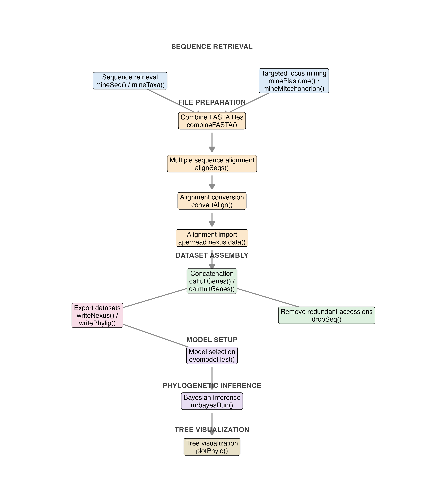

---
format:
  html:
    toc: true
    page-layout: custom
execute:
  echo: false
  eval: true
  freeze: auto
  cache: false
  warning: false
  message: false
  include: true
  # ENABLE inline R code evaluation
  inline: true
resources:
  - figures/
---

  
  

::: whitebox
::: {style="padding-left: 100px; padding-right: 50px; display: inline-block;"}

::: {layout-ncol="2"}

::: {style="text-align: left;"}

\

## Tools for DNA alignment concatenation, sequence mining, and phylogenetic analysis in R

`catGenes` is an R package designed to support reproducible phylogenetic and phylogenomic workflows, from sequence retrieval and alignment preparation to multilocus dataset assembly, model selection, Bayesian inference, and tree visualization.

Although originally developed to compare and concatenate multiple DNA alignments, `catGenes` now provides a broader suite of tools for retrieving sequences from GenBank, mining loci from plastid and mitochondrial genomes, combining FASTA files, performing automated multiple sequence alignment, converting alignment formats, exporting partitioned datasets, generating `MrBayes` command blocks, running `MrBayes` from R, and editing phylogenetic trees with `ggtree`.

## What `catGenes` can do

- retrieve DNA sequences from GenBank using accession numbers or taxonomic queries
- mine targeted loci from plastid and mitochondrial genomes
- combine multiple `FASTA` files into a single file
- perform automated multiple sequence alignment
- convert alignments among `FASTA`, `NEXUS`, and `PHYLIP` formats
- compare and concatenate multilocus datasets with or without duplicated accessions
- export concatenated datasets with partition information for downstream analyses
- select evolutionary models and prepare `MrBayes` blocks
- run `MrBayes` directly from R
- visualize and edit phylogenetic trees with `ggtree`

## Why use `catGenes`?

Phylogenetic workflows often require moving across multiple software tools and file formats, with repeated manual editing of sequence labels, alignments, partitions, and analysis settings. `catGenes` was developed to streamline these steps within a unified R-based workflow, making it easier to assemble, standardize, analyze, and document multilocus DNA datasets for phylogenetic and phylogenomic studies.

The package is especially useful for researchers working with:
- multilocus Sanger to genome-level datasets
- plastid or mitochondrial loci mined from organellar genomes
- datasets containing duplicated taxa or multiple accessions
- partitioned Bayesian phylogenetic analyses
- reproducible tree editing and figure preparation in R

## Typical phylogenetic workflow with `catGenes`

The diagram below summarizes a typical `catGenes` workflow, from sequence retrieval and alignment preparation to concatenation, model selection, phylogenetic inference, and tree visualization.

*Overview of the main `catGenes` workflow, highlighting sequence retrieval, FASTA combination, sequence alignment, alignment conversion, concatenation, export of partitioned datasets, model selection, phylogenetic inference, and tree visualization.*

## Development and scope

`catGenes` is maintained as part of a broader effort to support reproducible biodiversity and phylogenetic research workflows at the [Rio de Janeiro Botanical Garden (JBRJ)](https://www.gov.br/jbrj). The package continues to expand beyond its original concatenation focus and now integrates several steps commonly required in molecular systematics and phylogenomics.

:::
::: {style="display: flex; gap: 16px; justify-content: center; align-items: center;"}
:::
:::
:::
:::

::: mainbox
::: {style="padding-left: 100px; padding-right: 100px; display: inline-block;"}

::: {layout-ncol="3"}

::: {style="text-align: center;"}
### [Get Started](/get-started/index.qmd)

Install `catGenes` and begin with the main workflow and basic examples.
:::

::: {style="text-align: center;"}
### [Articles](/articles/index.qmd)

Browse tutorials and practical guides for sequence retrieval, concatenation, and phylogenetic analysis.
:::

::: {style="text-align: center;"}
### [Reference](/reference/index.qmd)

Explore the full function reference for all exported `catGenes` tools.
:::
:::
:::
:::

:::
